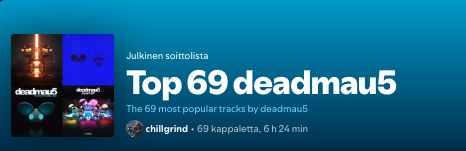

# top-n-spotify
Generate Spotify top playlist by giving an artist name and wanted amount of tracks.
This will create a public playlist on your profile with the most popular n tracks from that artist.

## Prerequisites

*   Modern version of Python
*   A Spotify account (Free or Premium)
*   `uv` as the **superior** Python package manager (on Mac you can use brew to install it)

## Setup Instructions

### 1. Set Up Your Spotify Developer App

You need to register an "app" on Spotify's developer portal to get the credentials that the script needs to access the API.

1.  Go to the [Spotify Developer Dashboard](https://developer.spotify.com/dashboard/) and log in.
2.  Click **"Create app"**.
3.  Give your app a **Name** (e.g., "top-n-spotify") and arbitrary **Description**.
4.  Set the **Redirect URIs** field as:
    ```
    http://127.0.0.1:8888/callback
    ```
5.  Once created, you will see your **Client ID**. Click **"Show client secret"** to see your **Client Secret**. You will need both of these soon.

### 2. Prepare the Project

1.  **Clone the Repository:**
    ```bash
    git clone git@github.com:boko-maru/top-n-spotify.git
    cd top-n-spotify
    ```

2.  **Set Up the Python Environment (using `uv`):**
    `uv` is a modern, blazingly fast & easy alternative to `pip`, `venv`, `poetry`, etc.
    To sync the needed dependencies you just run:
    ```bash
    uv sync
    ```

### 3. Configure Your Credentials

Create an `.env` file in the root of the project.
Copy the following template into it, replacing the placeholders with the credentials from your Spotify app:
    
    ```
    SPOTIPY_CLIENT_ID='Your_Client_ID_Here'
    SPOTIPY_CLIENT_SECRET='Your_Client_Secret_Here'
    SPOTIPY_REDIRECT_URI='http://127.0.0.1:8888/callback'
    ```

## 🏃‍♀️ How to Run

**Specify an artist and the number of top tracks:**
```bash
uv run top-n-spotify.py "Artist Name" <N>
```
> **Note:** If the artist's name contains spaces, you must enclose it in quotes.

**Example usage:**
```bash
uv run top-n-spotify.py deadmau5 69
```



### About First-Time Authentication

The very first time you run the script, a browser window will open asking you to grant permission.
The script will then save a local `.cache` file, so you won't need to do this again unless your credentials change or expire.
